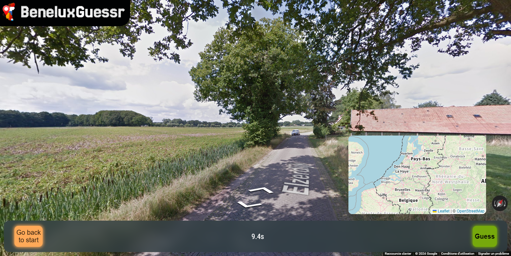

# BeneluxGuessr

An open-source geography-guessing game based on the Benelux.

## Introduction

Try to guess your location in the Benelux with the given StreetView.

Then, place your marker on the map to submit your guess!

Be the most accurate to get the best score!

## Languages

Available in English, French, Dutch and Luxembourgish.